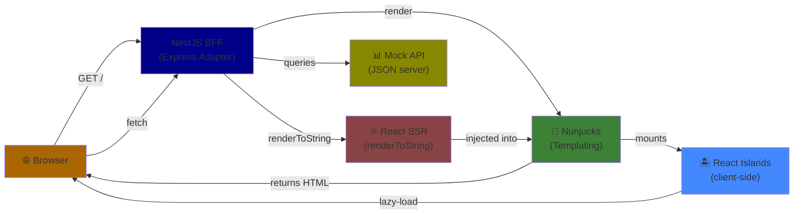

# Architecture Documentation

## System Overview



## Request Flow

### 1. Initial Page Load

```
Client Browser Request
    ↓
NestJS Route Handler
    ↓
ReactSSRService.render(Component, props)
    ├→ React.renderToString(element)
    └→ Returns HTML string
    ↓
Nunjucks Template Engine
    ├→ Extends base.njk
    ├→ Injects SSR HTML
    ├→ Adds island mount points
    └→ Includes static asset references
    ↓
Send complete HTML to Browser
```

### 2. Client-Side Initialization

```
Browser receives HTML
    ↓
Script loads: /js/entry.js (ES module)
    ├→ import { initAll } from 'govuk-frontend'
    ├→ initAll() - Initializes GOV.UK components
    └→ Queries [data-island] elements
    ↓
For each island:
    ├→ Extract bundle URL from data-island attribute
    ├→ Extract props from data-props attribute (XSS-safe)
    └→ await import(bundleUrl)
    ↓
Island mount.tsx default export called
    ├→ createRoot(el)
    └→ root.render(<Component {...props} />)
```

### 3. User Interaction

```
User interacts with island (e.g., button click)
    ↓
React state updates in island
    ↓
Component re-renders client-side
    ↓
DOM updates in browser
    ↓
Debounced background POST request sends client-side state to BFF
    ↓
Authoritative server-side state updates in BFF
    ↓
User reloads page
    ↓
Updated authoritative server-side state renders in UI
```

## Rendering Modes

### Server-Side Rendering (SSR) - Nunjucks

**Use cases:** Static page layouts, forms, informational content

**Process:**

1. NestJS route handler calls `res.render('template', { data })`
2. Nunjucks engine processes template
3. Macros and partials include

**Output:** Complete, functional HTML

### Server-Side Rendering (SSR) - React

**Use cases:** Data presentation, complex/custom components without significant JS interactivity

**Process:**

1. Component defined in `src/react/ssr/components/*.tsx`
2. Service calls `ReactSSRService.render(Component, props)`
3. `renderToString` returns HTML string
4. String injected into Nunjucks template (marked `| safe`)

**Output:** HTML string (no JS interactivity)

### Client-Side Islands

**Use cases:** complex/custom components requiring significant JS interactivity

**Process:**

1. Server renders island SSR component as HTML (initial state)
2. Marks mount point with `data-island` and `data-props` attributes
3. Client-side entry.ts detects islands
4. Dynamically imports island bundle
5. Island's mount.tsx creates React root and renders component
6. Component now interactive via React hooks/state

**Output:** Interactive React component (only the individual component in isolation, not the full app)

## GOV.UK Frontend Integration

### CSS

- Precompiled CSS bundle: `govuk-frontend.min.css`
- Served from `/assets/` directory
- Copied during build via `copy-assets.ts` script

### Components (Nunjucks)

- Macros available via search path: `node_modules/govuk-frontend/dist`
- Used directly in `.njk` templates
- Example: ``

### JavaScript

- Initialization via `govuk-frontend` npm package
- Called in client entry: `initAll()`
- Activates interactive components (accordion, details, tabs, etc.)

## Asset Pipeline

```
Development:
┌─────────────────────┐
│  copy-assets        │  Copy GOV.UK CSS, fonts, images
├─────────────────────┤  Watches: node_modules/govuk-frontend/dist
│  build:islands:watch│  Build islands, watch for changes
├─────────────────────┤  Input: client/islands/**/mount.tsx
│  nest start --watch │  Output: public/js/islands/**/mount.js
└─────────────────────┘  Watches: src/**/*.ts

Production:
┌────────────────────────┐
│  npm run build         │
├────────────────────────┤
│  1. copy-assets        │  One-off copy
│  2. nest build         │  Compile NestJS to dist/
│  3. build-islands.ts   │  Build & minify islands
└────────────────────────┘

Output Structure:
  dist/                    (NestJS compiled)
  public/
  ├── assets/
  │   ├── govuk-frontend.min.css
  │   ├── example-island.css
  │   ├── fonts/
  │   └── images/
  └── js/
      ├── entry.js
      └── islands/
          └── ExampleIsland/
              └── mount.js
```

## Data Flow: Session State

```
1. Client sends request
    ↓
2. Express session middleware:
   - Reads session cookie (or creates new)
   - Populates req.session
   ↓
3. NestJS controller/middleware can:
   - Read: req.session.data
   - Write: req.session.data = value
   - Store validation errors: req.session.validationErrors = { step, errors }
   ↓
4. Before response:
   - Session automatically serialized to client cookie
   ↓
5. Next request includes same cookie
   - Session restored for that request
```

## Validation Flow

```
Request arrives with body data
    ↓
Global ValidationPipe:
  - Parses JSON
  - Transforms via class-transformer
  - Validates via class-validator
    ↓
If valid:
    └→ Controller receives clean, typed data

If invalid:
    └→ HttpExceptionFilter catches errors
       └→ Renders error.njk with status + message
       └→ Can optionally store in session for form re-render
```

## Error Handling

```
Unhandled Exception
    ↓
HttpExceptionFilter.catch(exception, host)
    ├→ Logs error
    ├→ Renders error.njk template
    └→ Includes status code + message
```

## Module Structure

```
AppModule
├── ConfigModule (global)
├── ReactModule
│   └── ReactSSRService (provided, exported)
└── AppController (GET / routes)

ReactModule
└── Providers:
    └── ReactSSRService
        └── render<P>(component, props): string
```

## Configuration

**Loaded from environment variables** via `src/config/configuration.ts`:

```typescript
export default () => ({
  port: parseInt(process.env.PORT || "3000", 10),
  mockApiBaseUrl: process.env.MOCK_API_BASE_URL || "http://localhost:3001",
  sessionSecret: process.env.SESSION_SECRET || "dev-secret",
  nodeEnv: process.env.NODE_ENV || "development",
});
```

Injected globally via `ConfigModule.forRoot({ isGlobal: true })`.

## Bundling Strategy

### Entry Points

**1. Main Application Bundle: `src/client/entry.ts`**

- Imports GOV.UK Frontend `initAll`
- Scans for `[data-island]` elements
- Lazy-loads island bundles on demand

**2. Island Bundles: `src/client/islands/**/mount.tsx`\*\*

- One bundle per island
- Exported default: `(el: HTMLElement, props: any) => void`
- Creates React root in the provided element

### Output

- **Format:** ES Modules (`format: 'esm'`)
- **Target:** ES2020 (modern browsers)
- **Tree-shaking:** Enabled
- **Development:** Sourcemaps included
- **Production:** Minified, no sourcemaps

### Why Separate Bundles?

1. **Code splitting:** Only download island code when island is used
2. **Lazy loading:** Entry.ts uses dynamic `import(bundleUrl)`
3. **Independent:** No shared state between islands
4. **Scalable:** Add new islands without modifying entry.ts

## Security Considerations

### XSS Protection in Islands

When rendering island mount points, props are JSON-stringified with character escaping:

```typescript
const safeProps = JSON.stringify(props)
  .replace(/</g, "\\u003c")
  .replace(/>/g, "\\u003e")
  .replace(/&/g, "\\u0026")
  .replace(/'/g, "\\u0027");

return `<div data-props='${safeProps}'></div>`;
```

This prevents JavaScript injection via props.

### Session Security

- `secure: false` for development (no HTTPS requirement)
- Change `SESSION_SECRET` in production
- Use `secure: true` in production (HTTPS only)
- Set `httpOnly: true` for production

### CSRF Protection

Not included in Phase 1. Recommended for future phases when handling form submissions.

## Performance Characteristics

### SSR Benefits

- Full HTML sent to browser (no JS parsing needed for initial render)
- Content immediately visible
- SEO-friendly (all content in HTML)
- Progressive enhancement (works without JS)

### Island Benefits

- Code-splitting: Only necessary JS loaded
- Lazy loading: Islands JS downloads only when needed
- Small bundles: Each island is independent
